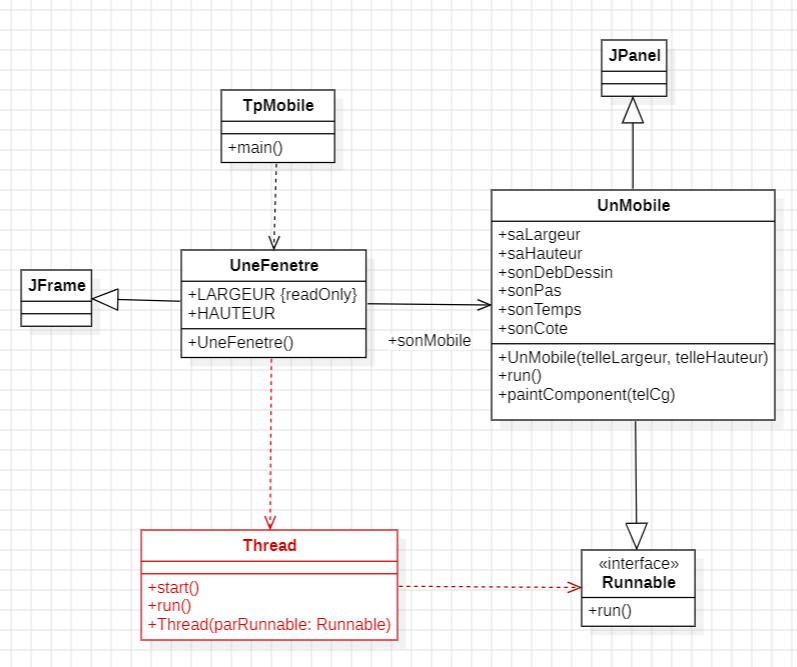
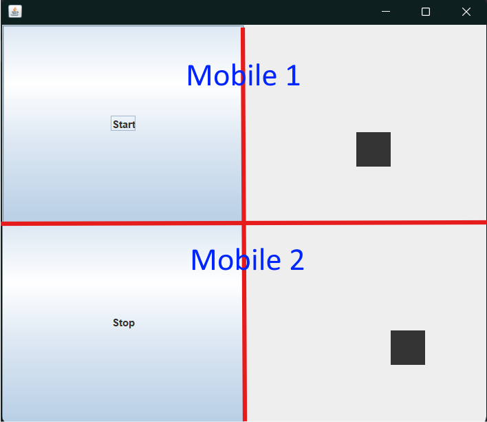
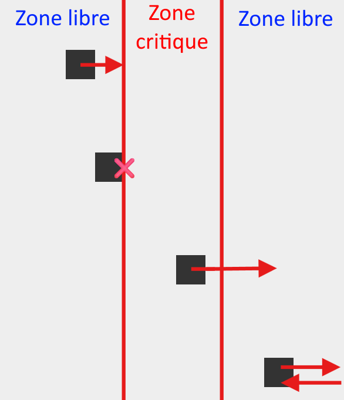
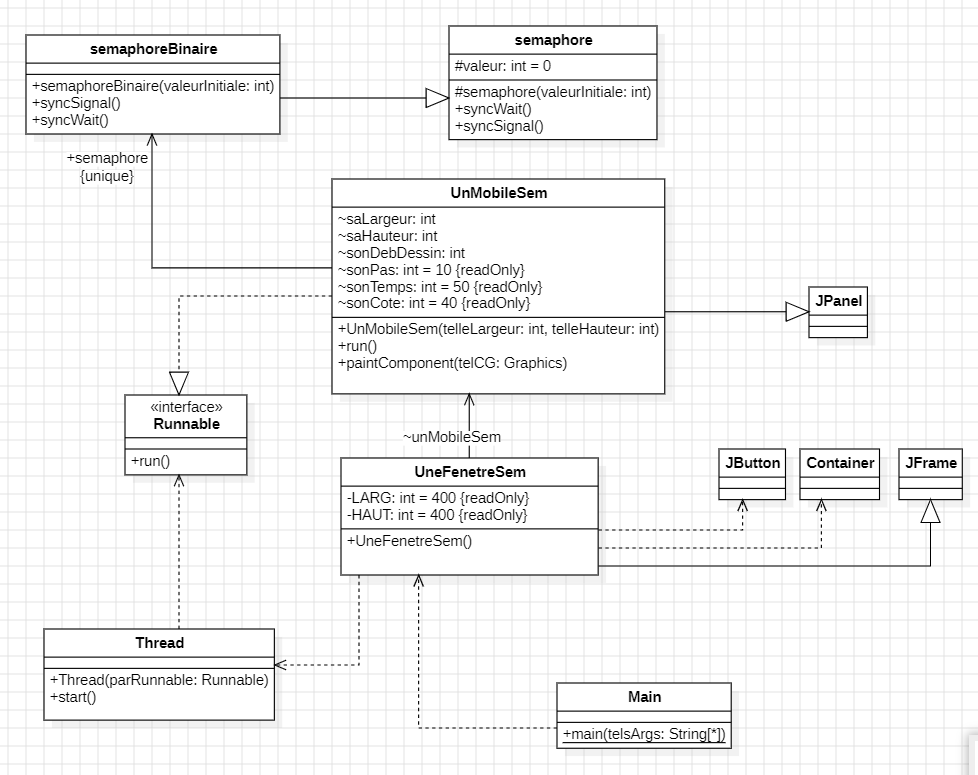
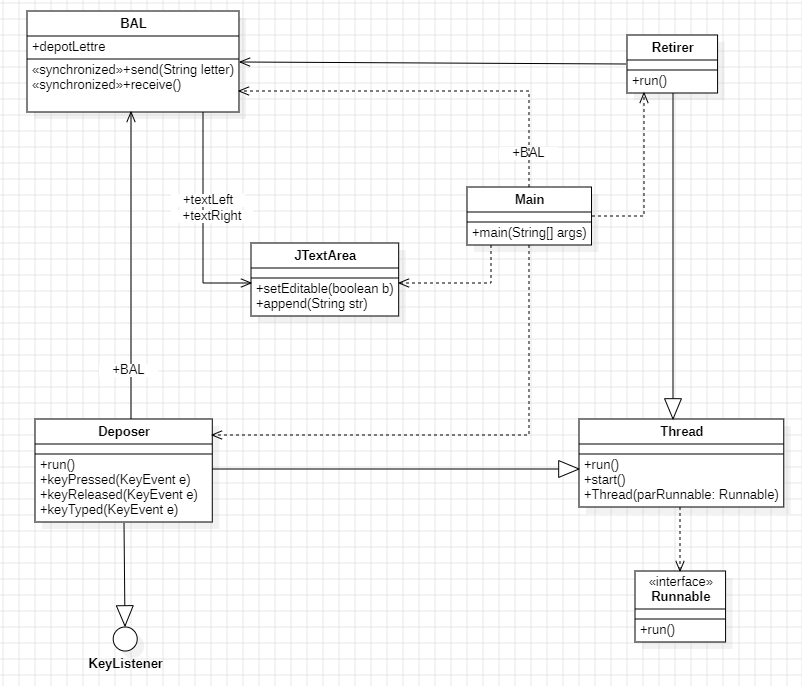
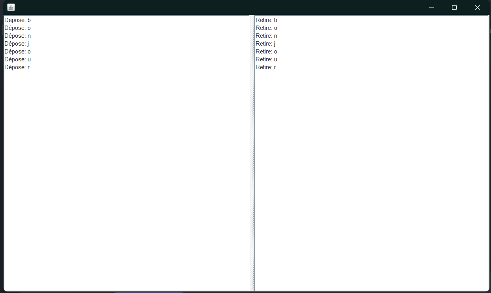
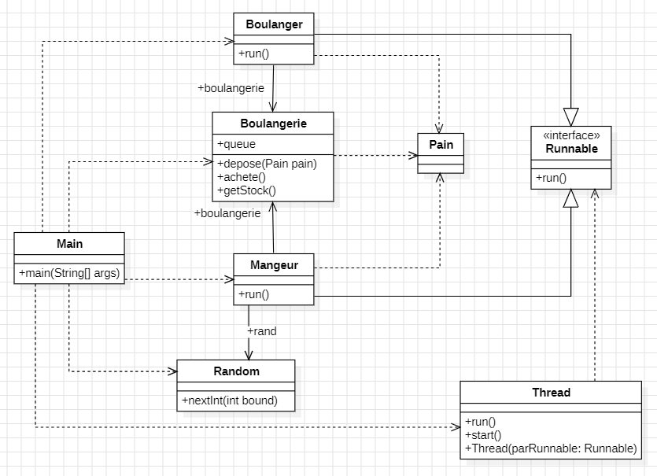

# Programmation avancée - BUT 3 - 2024
> Réalisé par Ewen GILBERT  
> *La rédaction et la réalisation des TP ont été réalisés avec l'aide d'outils d'intelligence artificielle et de mes camarades de BUT Informatique.*  
> *Source complémentaire pour la partie Boulangerie du TP3 : https://blog.paumard.org/cours/java-api/chap05-concurrent-queues.html*

## Table des matières
- [Introduction](#introduction)
- [TP 1 - Les Treads Java](#tp-1---les-treads-java-avec-les-mobiles)
  * [Exercice 1](#exercice-1)
  * [Exercice 2](#exercice-2)
  * [Exercice 3](#exercice-3)
- [TP 2 - Affichage synchronisé](#tp-2---affichage-synchronisé)
- [TP 2 (bis) - Application des sémaphores sur les mobiles du TP1](#tp2-bis---application-des-sémaphores-sur-les-mobiles-du-tp1)
- [TP 3 - Boîte aux lettres et boulangerie](#tp-3--boîte-aux-lettres-et-boulangerie)
  * [Partie 1 : La Boîte aux Lettres](#partie-1--la-boîte-aux-lettres)
  * [Partie 2 : La Boulangerie](#partie-2--la-boulangerie)


## Introduction

Ce document et ce dépôt ont pour objectif de présenter et de détailler les travaux effectués dans le cadre du cours de programmation avancée de BUT 3, portant sur l'apprentissage de la programmation parallèle et en particulier sur l'utilisation des threads et des sémaphores en Java.

## TP 1 - Les Treads Java avec les mobiles

Ce TP nous a permis d'être introduits au concept de **programmation parallèle** en Java, en utilisant des **threads** pour contrôler le mouvement de mobiles dans une interface graphique. Nous avons également appris à gérer l'interaction entre les threads et l'interface utilisateur en utilisant des boutons pour contrôler le mouvement des mobiles grâce aux classes `UnMobile` et `UneFenetre`.

La **programmation parallèle** est un concept permettant d'exécuter plusieurs tâches simultanément, ce qui est particulièrement utile pour les applications nécessitant des opérations en temps réel ou des tâches longues. Dans notre cas, nous avons utilisé des threads pour contrôler le mouvement des mobiles, ce qui permet de simuler plusieurs objets mobiles se déplaçant en même temps dans une interface graphique.

Ce concept se base sur la **division des tâches en sous-tâches plus petites**, permettant notamment de répartir la charge de travail entre plusieurs threads et d'optimiser les performances de l'application en utilisant efficacement les ressources du système.

Voici le diagramme de classe de l'application "Mobiles" :
   
##### *Figure 1 : Diagramme de l'application "Mobiles"*

### Exercice 1

La classe `UnMobile` représente un objet mobile qui se déplace horizontalement dans une interface graphique, en utilisant un thread pour contrôler son mouvement. L'animation est réalisée en exécutant une boucle dans la méthode `run()`, qui appelle `repaint()` à intervalles réguliers pour redessiner le mobile à sa nouvelle position.

Dans la méthode `run()`, une boucle itère jusqu'à ce que le mobile atteigne le bord droit de la fenêtre. À chaque itération :

- `sonDebDessin` (la position actuelle du mobile) est incrémenté de `sonPas`, ce qui déplace le mobile vers la droite.
- La méthode `repaint()` est appelée pour redessiner le mobile à sa nouvelle position.
- La méthode `sleep()` permet de suspendre temporairement le thread, contrôlant ainsi la vitesse du mouvement.

Cela nous permet de simuler un déplacement du mobile dans l'interface.

Maintenant, on souhaite mettre en place un moyen de **faire faire un aller retour** à notre mobile et pour celà, je modifie la méthode `run()`.

On utilise **deux boucles successives** : 
- La première boucle for **incrémente la position** `sonDebDessin` pour faire avancer le mobile de gauche à droite. 
- Une fois le bord droit atteint, la deuxième boucle `for` prend le relais pour **décrémenter `sonDebDessin`** et ramener le mobile vers la gauche.

À chaque itération, `repaint()` redessine le mobile à sa nouvelle position, tandis que `Thread.sleep(sonTemps)` crée une pause pour contrôler la vitesse de déplacement. Avec cette méthode, pas besoin d'utiliser une variable supplémentaire de direction, car le changement de direction est géré par les deux boucles.

### Exercice 2

Dans cette étape, nous avons ajouté un bouton pour contrôler l'animation du mobile, en utilisant les méthodes `suspend()` et `resume()` de la classe `Thread`.

- Ajout du bouton `sonBouton` : Le bouton est placé en bas de la fenêtre (`BorderLayout.SOUTH`). Par défaut, son texte est "Stop", indiquant que l'animation est en cours.
- Gestion de l’état du Thread : Un `ActionListener` sur le bouton contrôle l’état du Thread.
  - **Si le mobile est en mouvement** (isRunning est true), le bouton arrête l'animation en appelant `laThread.suspend()`, puis change le texte du bouton en "Start".
  - **Si l’animation est arrêtée**, un clic relance le mouvement avec `laThread.resume()` et remet le texte du bouton à "Stop".

*Notons que les expressions suspend() et resume() sont dépréciées.*

### Exercice 3

Pour cet exercice, nous avons modifié `UneFenetre` afin d'utiliser un `GridLayout` et afficher deux instances de `UnMobile` avec leurs boutons respectifs.

#### Changement de la disposition de la fenêtre
Déjà, j'ai remplacé `BorderLayout` par un `GridLayout` avec **2 lignes et 2 colonnes**, ce qui permet d’afficher chaque mobile et son bouton dans une grille.

#### Ajout d'un deuxième mobile
Ensuite, j'ai ajouté les deux mobiles et de leurs boutons avec deux instances de `UnMobile` (`sonMobile1` et `sonMobile2`) avec leurs propres boutons de contrôle (`btnControl1` et `btnControl2`). Chaque bouton est positionné à gauche de son mobile correspondant.

#### Gestion des boutons
Enfin, chaque bouton utilise un `ActionListener` distinct pour contrôler l’animation de son mobile en appelant `suspend()` et `resume()` sur son propre thread (`laThread1` et `laThread2`). Ce système permet d’arrêter et de relancer chaque mobile de manière indépendante.

Avec cette configuration, l’interface dispose les éléments dans une grille et permet de gérer les deux mobiles individuellement.

   
##### *Figure 2 : Interface de l'application "Mobiles" en GridLayout*

---
## TP 2 - Affichage synchronisé

Dans le cadre de ce TP, nous avons exploré l'utilisation de threads en Java pour synchroniser deux tâches (TA et TB) en utilisant la classe `Affichage` pour gérer l'affichage dans la console. Le but est de garantir **l'exclusion mutuelle entre les threads**, afin que leurs messages s'affichent dans des **séquences prédéfinies** (AAABB ou BBAAA) **et non de manière entrelacée** (ABABA). Pour cela, nous avons utilisé des **sémaphores binaires** pour contrôler l'accès aux **sections critiques** des threads.

### Analyse du code déjà présent

- **Classe Affichage :** La classe `Affichage` hérite de `Thread`, et chaque instance prend un string à afficher. La méthode `run()` parcourt chaque caractère et l'affiche, avec une pause de 100 millisecondes entre chaque caractère pour simuler un délai dans l'affichage.

- **Semaphore** : Le rôle de cette classe est de **contrôler l'accès à la section critique**, c'est-à-dire l'endroit où une tâche peut afficher son message sans interruption par une autre. Le **sémaphore binaire** est modélisé pour avoir deux états : "libre" ou "occupé".

#### Incrémentation et Décrémentation du Sémaphore :

Lorsqu'un **sémaphore binaire** est initialisé, il reçoit une valeur (1 ou 0). Cette valeur représente la **disponibilité de la section critique**. Une valeur de `1` indique que la section critique est libre et une valeur de `0` indique qu'elle est occupée.

- **Décrémentation :** Lorsqu'une tâche veut entrer en section critique, elle **décrémente** la valeur du sémaphore. Si la valeur atteint 0, **la tâche obtient l'accès à la section critique**. Toute autre tâche essayant de décrémenter à 0 sera bloquée jusqu’à ce que le sémaphore soit réinitialisé.

- **Incrémentation :** Lorsqu’une tâche a terminé son travail en section critique, elle **incrémente** la valeur. Cela **libère la section critique** et permet à une autre tâche en attente d'y entrer.

### Classe Main

L'objectif de cette classe est de s'assurer que les messages "AAA" et "BB" générés respectivement par les tâches taskA et taskB s'affichent de manière cohérente, en suivant des séquences de type AAABB ou BBAAA.

```java
public class Main {
	public static void main(String[] args) {
		semaphoreBinaire semaphore = new semaphoreBinaire(1);

		Thread taskA = new Thread(() -> {
			try {
				semaphore.syncWait(); // bloque si la section critique est occupée
				System.out.println("j'entre en section critique - Task A");
				new Affichage("AAA").run(); // affiche le message
				System.out.println("je sors de section critique - Task A");
			} finally {
				semaphore.syncSignal(); // libère la section critique
			}
		});

		Thread taskB = new Thread(() -> {
			try {
				semaphore.syncWait(); // bloque si la section critique est occupée
				System.out.println("j'entre en section critique - Task B");
				new Affichage("BB").run(); // affiche le message
				System.out.println("je sors de section critique - Task B");
			} finally {
				semaphore.syncSignal(); // libère la section critique
			}
		});

		taskA.start();
		taskB.start();
	}
}
```

La classe `Main` commence par créer une instance de `semaphoreBinaire` initialisée avec une valeur de `1`, indiquant que **la section critique est disponible**. Ce sémaphore binaire sert à **réguler l'accès à la section critique** en autorisant **une seule tâche à la fois**.

Ensuite, on crée deux tâches, taskA et taskB, sous forme d'objets `Thread`. Ces tâches utilisent des instances de la classe `Affichage` pour afficher "AAA" et "BB".

Chaque tâche appelle `semaphore.syncWait()` avant d’accéder à la section critique qui **bloque la tâche si la section critique est occupée**. Une fois en section critique, on utilise new `Affichage(texte).run()` pour afficher son message. Après avoir affiché le message, on appelle `semaphore.syncSignal()` qui libère la section critique pour permettre à l’autre tâche d’y accéder. Les threads taskA et taskB sont démarrés en même temps, et grâce au sémaphore binaire, **seule l'une des deux peut entrer en section critique à la fois**, ce qui permet d’afficher les messages sans entrelacement indésirable.

   
##### *Figure 3 : Résultat affiché dans la console lors de l'exécution de Main*

## TP2 (bis) - Application des sémaphores sur les mobiles du TP1

Dans cette partie, le but est d'adapter les mobiles pour qu'ils traversent une **zone critique au centre de la fenêtre**. La zone critique ne peut contenir qu'**un mobile à la fois**, et la synchronisation est gérée par un **sémaphore binaire**.

Dans notre cas, la **zone critique** est définie comme le second tiers de la fenêtre comme illustré sur la figure 4. Un **sémaphore binaire** assure que cette zone n'est occupée que par **un seul mobile à la fois** et **stoppera les autres mobiles** jusqu'à ce que la zone soit libérée.

Ceux-ci appellent `syncWait()` lorsqu’ils arrivent au début de la zone critique, ce qui les autorise à entrer si la zone est libre. Ensuite, lorsqu'ils **sortent de la zone critique**, ils appellent `syncSignal()` pour libérer la zone, permettant à un autre mobile d’y entrer.

Extrait du code de [UneFenetreSem.java](./TP2_Affichage/UneFenetreSem.java) permettant d'initialiser un mobile :
```java
public UneFenetreSem() {
    semaphore = new semaphoreBinaire(1);
    setLayout(new GridLayout(4, 1));

    mobile1 = new UnMobileSem(LARG, HAUT / 4, semaphore);
    add(mobile1);
    new Thread(mobile1).start();

    // Initialisation des autres mobiles...

}
```

Extrait du code de [UnMobileSem.java](./TP2_Affichage/UnMobileSem.java) permettant de gérer le déplacement du mobile dans la zone critique:
```java
public void run() {
        while (true) {
            if (directionDroite) {
                sonDebDessin += sonPas; // Déplacement vers la droite
            } else {
                sonDebDessin -= sonPas; // Déplacement vers la gauche
            }

            if (sonDebDessin >= saLargeur) { // Si le mobile atteint le bord droit, on change de direction
                directionDroite = false;
            } else if (sonDebDessin <= 0) { // Si le mobile atteint le bord gauche, on change de direction
                directionDroite = true;
            }

            if (sonDebDessin >= saLargeur / 3 && sonDebDessin <= 2 * saLargeur / 3) { // Si le mobile atteint dans la zone critique
                if (directionDroite) { // Si le mobile se déplace vers la droite
                    semaphore.syncWait(); // On bloque le mobile si la zone critique est occupée

                    // Une fois le syncWait dépassé (donc que la zone critique est libre), on continue le déplacement
                    while (sonDebDessin <= 2 * saLargeur / 3 && directionDroite) {
                        sonDebDessin += sonPas;
                        repaint();
                        try {
                            Thread.sleep(sonTemps);
                        } catch (InterruptedException e) {
                            e.printStackTrace();
                        }
                    }
                    semaphore.syncSignal(); // On libère la zone critique

                } else { // Si le mobile se déplace vers la gauche
                    semaphore.syncWait(); // On bloque le mobile si la zone critique est occupée

                    // Une fois le syncWait dépassé (donc que la zone critique est libre), on continue le déplacement
                    while (sonDebDessin >= saLargeur / 3 && !directionDroite) {
                        sonDebDessin -= sonPas;
                        repaint();
                        try {
                            Thread.sleep(sonTemps);
                        } catch (InterruptedException e) {
                            e.printStackTrace();
                        }
                    }
                    semaphore.syncSignal(); // On libère la zone critique
                }
            }

            repaint(); // Sinon, on continue le déplacement

            try {
                Thread.sleep(sonTemps);
            } catch (InterruptedException e) {
                e.printStackTrace();
            }
        }
    }
```

   
##### *Figure 4 : Les mobiles et la zone critique*

   
##### *Figure 5 : Diagramme de classe de l'application "Mobiles" avec sémaphores*

---

## TP 3 : Boîte aux lettres et boulangerie

Le TP 3 introduit le concept de **Blocking Queue**, en commençant par une première implémentation guidée, puis une version plus complexe reprenant l'exemple de la boulangerie à partir de [ce cours](https://blog.paumard.org/cours/java-api/chap05-concurrent-queues.html) pour mieux comprendre la synchronisation des threads.

### Partie 1 : La Boîte aux Lettres (BAL)

La première partie du TP consiste à implémenter une simple **boîte aux lettres** entre un **producteur** et un **consommateur**. Le producteur est chargé de déposer une lettre dans la boîte (illustré par la classe `Deposer`), tandis que le consommateur est chargé de la retirer (illustré par la classe `Retirer`).

Les règles de fonctionnement de la boîte aux lettres sont les suivantes :
- Le producteur ne peut **déposer** une lettre **que si la boîte est vide**.
- Le consommateur ne peut **retirer** une lettre **que si la boîte n'est pas vide**.

Ainsi, il est nécessaire d'utiliser des mécanismes de **synchronisation** pour s'assurer que ces conditions sont respectées. La classe `BAL` représente cette boîte aux lettres, et les méthodes `send()` et `receive()` utilisent les instructions `wait()` et `notify()` pour gérer la synchronisation entre les threads.

Voici un extrait de la classe `BAL` :

```java
public synchronized void send(String lettre) {
    try {
        while(depotLettre != null) {
          wait(); // Bloque le producteur si la boîte n'est pas vide
        }
    
        System.out.println("Dépose: " + lettre);
        textLeft.append("Dépose: " + lettre + "\n");
        depotLettre = lettre;
        notify(); // Notifie le consommateur que la boîte n'est plus vide
    }
    catch(InterruptedException e) {
        e.printStackTrace();
    }
}

public synchronized String receive() {
    try {
        while (depotLettre == null) {
          wait(); // Bloque le consommateur si la boîte est vide
        }
        String lettre = depotLettre;
    
        depotLettre = null;
        notify(); // Notifie le producteur que la boîte est vide
    
        System.out.println("Retire: " + lettre);
        textRight.append("Retire: " + lettre + "\n");
        return lettre;
    }
    catch(InterruptedException e) {
        e.printStackTrace();
        return "echec";
    }
}
```

Dans ce code, la méthode `send()` **bloque le producteur** tant qu'une lettre est présente dans la boîte, et la méthode `receive()` **bloque le consommateur** si la boîte est vide. Lorsque la boîte change d'état, **le thread en attente est notifié**.

   
##### *Figure 6 : Diagramme de classe de l'application "BAL"*

   
##### *Figure 7 : Interface de l'application "BAL"*

### Partie 2 : La Boulangerie

La deuxième partie du TP se concentre sur une version plus complexe du producteur-consommateur à travers l'exemple d'une boulangerie. Dans cette version, plusieurs **boulangers** produisent des **pains**, et plusieurs **mangeurs** les consomment, en utilisant une structure de file d'attente bloquante plus évoluée : `ArrayBlockingQueue`.

La classe `Boulangerie` contient une file bloquante de type `ArrayBlockingQueue` qui peut contenir jusqu'à 20 pains. Voici un extrait de cette classe :

```java
import java.util.concurrent.*;

public  class Boulangerie {

    private BlockingQueue<Pain> queue =  new ArrayBlockingQueue<Pain>(20) ;
  
    public  boolean depose(Pain pain)  throws InterruptedException {
        return queue.offer(pain,  200, TimeUnit.MILLISECONDS) ;
    }
  
    public Pain achete ()  throws InterruptedException {
        return queue.poll(200, TimeUnit.MILLISECONDS) ;
    }
  
    public  int getStock() {
        return queue.size() ;
    }
}
```

Ici, la file d'attente permet de gérer efficacement l'accès concurrent aux pains produits par les boulangers. La méthode `offer()` ajoute un pain à la file s'il y a de la place, et que la méthode `poll()` récupère un pain s'il y en a un de disponible.

Les classes `Boulanger` et `Mangeur` implémentent l'interface `Runnable` et représentent respectivement les producteurs et les consommateurs. Voici un extrait de la classe `Boulanger` :

```java
public class Boulanger implements Runnable {
    Boulangerie boulangerie;

    public Boulanger(Boulangerie boulangerie) {
        this.boulangerie = boulangerie;
    }

    public void run() {
        try {
            while (true) {
                Thread.sleep(1000);
                boolean added = boulangerie.depose(new Pain());
                if (added) {
                    System.out.println("[" + Thread.currentThread().getName() + "] [" + boulangerie.getStock() + "] je livre.");
                } else {
                    System.out.println("[" + Thread.currentThread().getName() + "] [" + boulangerie.getStock() + "] la boulangerie est pleine.");
                }
            }
        } catch (InterruptedException e) {
            System.out.println("[" + Thread.currentThread().getName() + "] je m'arrête");
        }
    }
}
```

Les boulangers ajoutent des pains à la boulangerie, et les mangeurs tentent de les récupérer. Les méthodes sont conçues pour attendre et réessayer jusqu'à ce qu'une opération soit possible, ce qui permet de simuler la dynamique d'une boulangerie où les pains sont produits et consommés de façon asynchrone.


##### *Figure 8 : Diagramme de classe de l'exemple de la Boulangerie*

### Parallèle entre Partie 1 et Partie 2

Dans la première partie, la boîte aux lettres (BAL) ne pouvait contenir qu'**une seule lettre à la fois**, et nous avions un seul producteur et un seul consommateur. La synchronisation était gérée manuellement à l'aide des méthodes `wait()` et `notify()`. Chaque élément était placé et retiré de manière individuelle.

Dans la deuxième partie, la boulangerie introduit une dimension plus complexe : **plusieurs producteurs et consommateurs**, ainsi qu'une capacité maximale de 20 pains à la fois. Plutôt que de gérer la synchronisation directement, nous utilisons une `ArrayBlockingQueue`, qui simplifie la coordination entre les threads producteurs et consommateurs.

Pour conclure, la deuxième partie permet de mettre en avant les avantages de l'utilisation d'éléments prêts à l'emploi en Java pour la gestion des problèmes de synchronisation, surtout lorsque plusieurs threads sont utilisées. `ArrayBlockingQueue` gère automatiquement la coordination entre les threads, ce qui évite les erreurs de synchronisation.